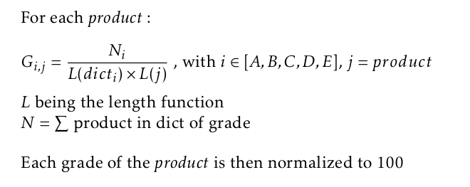

---
# Feel free to add content and custom Front Matter to this file.
# To modify the layout, see https://jekyllrb.com/docs/themes/#overriding-theme-defaults

layout: page
bigimg: /img/indexbg.jpg
---

# Do you buy healthy ?

# Introduction
Nowadays, there exists a myriad of products, examples of an ever-growing consumption regime. Furthermore, the convenience of accessing such items is only a few clicks away for most of us. In this project, we will reason on the health impact of certain foods, based on the consumer's point of view in today's world. Our starting point will be the Open food facts dataset, from which we will extract data on several different food products. Do the values that people hold dear stand up to the comparison with the food they actually buy ? We will try to answer these questions by first analysing the attributes of the food items such as for example nutritional index or content in the Openfoodfacts database. We will then find a way to assign a nutritional grade to the products bought online by consumers with the Instacart dataset. The popularity of particular items will play an important role in our analysis. 

# Initial analysis

## Motivation

Every food has intrinsic nutritive and health attributes. Our body needs some nutrients and vitamins in order to function properly, and failing to meet its demands can result in a bad life hygiene or even some diseases. Some people pay very close attention to the properties of the products they buy, and they can enjoy their body operating at its full potential. Others however, buy ingredients thinking nutrition is not a primordial argument in the choice they make. These are the people we are going to try and help. As we will see later on, the openfoodfacts database contains very specific informations about the nutritional values of many different products. The aim is to extract this information and to infer how real life orders place themselves on the health spectrum.

## Datasets
Our analysis relied on two datasets, and a crucial part was to find a way to link them. We had to find a way to extract some specific information contained in the first one, to then augment the features of the second dataset with it. First, we briefly describe the two datasets.  
### Openfoodfacts
Open Food Facts is a database of food products with ingredients, allergens, nutrition facts and all the tidbits of information that can be found on product labels. It is open source, maintained and turned bigger by everyday people, and everyone can access it. The goal is to transmit informations to the public, and allow it to make informed decisions about the food it consumes. 

Many different characteristics about the products could have been extracted. At first, we thought of using the carbon footprint, but we realised that this particular data is available on very few of the entries of the database, rendering any kind of comparison or conclusion meaningless because of the sample size. 
We thus primarily focused on the nutritional index and nutritional score. This data represents a condensed form of the health impact that particular food has on the human body. Namely, A represents very healthy food, such as vegetables, and E is what we should avoid eating, such as chocolate. Of course, this is often the food we crave the most. The scores allows for a more fine-grained approach. More specifically they represent the health impact that the product has on the consumer. To be even more precise, they are defined in the Open Food Facts documentation as *nutrition score defined by the UK Food Standards Administration (FSA)*. We can see that this data is the product of serious work done by professionals, and not only an impression written by consumers. An increasing number of manufacturers display it on their products ! 

### Instacart
Instacart is an American company that provides grocery delivery to households in the US and Canada. The dataset contains information about approximately 3 million orders. Every order has many attributes, such as content, time of order or even the order in which the products were added to the cart for example. Interesting patterns can be extracted from all of these features. In this analysis, we focused on the most ordered products, since they are the ones telling us the most about consumer habits. We will see 
The instacart database allows us to find out which types of food are bought the most by the customers. We will find out how well the most sought after products do in when focusing on their nutritional score.

### Cleaning
We started with the Open food facts database , where we removed the rows that have more than half of the data missing. These will introduce more problems than what they can actually contribute. 
Standard outliers and NaN removal has also been applied. 
We also removed columns that are mostly empty (  >850k rows have the corresponding value missing). We now have a size-reduced dataset, but the quantity of information itself did not get reduced significantly. 

<iframe align="center" id="igraph" scrolling="no" style="margin-right:auto; margin-left:auto; text-align:center;position:relative; border:none;" seamless="seamless" src="https://marcbickel.github.io/project_gobigorgohome/html/850k-filter.html" height="800px" width="150%"></iframe>

The instacart dataset was initially split into several sub-datasets. We linked these datasets by creating dataframes containing information about the products as well as the orders that contained them. This view serves us much better than the previous one. For the reasons made clear previously, we then only considered the products that make up 95% of the orders, which represents around 3000 products. 

# Linking the two datasets

Ne now have two datasets that each contain interesting information about food products, and we need a way to link them. In order to come up with such a way, we had to think about which information is contained in both. Since the words constituting the names of the products in Openfoodfacts and Instacart seemed to be the only such common feature, our goal became to create a word representation of the Openfoodfacts grades.  
We briefly present the methodology we followed on the Openfoodfacts dataset to come up with such a representation. After doing some sanitisation of the names, such as stop word and number removal, case folding and translation for example, we counted the number of occurrences of each word in the names of the products. The wordclouds below provide a visual representation of the different grades and their most frequent words.

 

We then created a dictionary of the most frequent words in each nutritional grade category.  Some results are easily predictable, like "bio" being the most used word in grade A, and "chocolate" being its counterpart in grade E. More info is found in the notebook. 

To create an accurate word representation, quite some time was spent translating all these words to english. This was done to avoid the bias of having some words referring to the same word and not being treated as such. We used a Google Translate API. Of course some languages were found more frequently than others, as is illustrated below.  

<iframe id="igraph" scrolling="no" style="position:relative; border:none;" seamless="seamless" src="https://marcbickel.github.io/project_gobigorgohome/html/word-per-language-html.html" height="500px" width="150%"></iframe>

The formula below to crystallised the link between the datasets. We computed a similarity score for each product, based on word occurrences. This allowed us to assign a grade to instacart items. 

Is there a general tendency discernable amongst orders ? Below is the plot of the items per grade found in each dataset. 

*plot nombre d'items dans chaque nutri grade (plot avec des petites barres horizontales?)*
<iframe id="igraph" scrolling="no" style="position:relative; border:none;" seamless="seamless" src="https://marcbickel.github.io/project_gobigorgohome/html/items_per_grade.html" height="550px" width="100%"></iframe>

## Weighted score

We will also introduce the _Weighted score_, that allows us to have a common scale to compare all the products' healthiness. We assign the following values: 

- -2 to E  
- -1 to D  
- 0 to C  
- 1 to B  
- 2 to A

Now, every item is projected in the dimension of every grade. We multiply that projection by the values above, and that give us the score of said item. More info in the notebook ! 

# Food rankings

With that setup, we can now establish rankings. The 5 most bought products in each category can be found below. 

# Findings
Do you buy these products as well ? Are you more inclined towards the ones in the A-grade or the E-grade ? 

Here are the 5 products that correspond the most to each nutritional grade. The scale is the percentage to which the product is attributed to that specific category. 
<iframe id="igraph" scrolling="no" style="position:relative; border:none;" seamless="seamless" src="https://marcbickel.github.io/project_gobigorgohome/html/top5grades.html" height="800px" width="100%"></iframe>

Some comments in the results: condoms make a lot of sense to be very unhealthy to eat, while cauliflowers are indeed very healthy ! We were first puzzled when we saw that bowties were in the B category. How could that be healthy ? We then dug in the data, went through a lot of searching, and finally found that this product refers to the pasta that has the shape of bowties, not the object where they got their name from. 

Now we can ask ourselves where we are in the complex landscape of food health. Can you recognise some of the staples of you diet ?

We can also find the grade relative to whole orders. Below are the grades totally absent from a given order. 

<iframe id="igraph" scrolling="no" style="position:relative; border:none;" seamless="seamless" src="https://marcbickel.github.io/project_gobigorgohome/html/number-orders-no-product-of-grade.html" height="525px" width="100%"></iframe>
What do we notice ? Since altogether there are 3'083'012 distinct orders, almost two thirds of those contain no B or E products. On the other hand, only very few orders contains no items in A. From this, the people ordering on instacart seem to have healthy consumer habits. To get a closer insight into what people put into their baskets, we produced the following plots, showing the proportion of a given grade inside the orders. One must keep in mind that orders containing no items of a given grade have been removed (hence the preceding countplot).

Several facts are shown by these histograms. Firstly, let us look at the bins showing the orders that contain 100 percent of products of a given grade. Excepts for grade A, it is very rare to have a basket containing only products of a given grade. Also, the number of orders containing only products of one grade may be biased due to the fact that single item orders are included in this plot (more details in the notebook). Some more details are worth mentioning, especially about grade A. The distribution symmetrically decreases around 50 % where it attains its maximum. It looks somewhat gaussian with mean 0.5, before it increases again du to the orders containing 100 % of products in 'a'. Since it is symmetric (discarding the 100 % bin) , we know that the median is close to the mode and therefore most orders contain half of products of grade A. Furthermore, orders containing more or less than 50 percent of grade a are equally likely to happen (still discarding the 100 % bin). About the other grades, we can see that they attain their mode around 20%-25%, showing a well-rounded order. Refer to the notebook for more details.

# Fun facts 
Amongst the different nutritional grades, some words that appear the most often are not food related words. However, one can easily imagine why these words come up as related to a specific grade. For example, in the wordcloud representation of the openfoodfacts database (that can be found in the notebook) of grade A, "without" is quite big, while "extra" appears as an important word in grade D. Furthermore, in this same representation of the instacart products "large lemon" is quite surprisingly one of the largest words. This misclassification of a healthy product, is probably due to the fact that the adjective "large" is often associated with unhealthy products.  

# To go further
In order to make better sense of the previous results, it is important to ask ourselves who the typical users of instacart are. Since it is an online grocery delivery service, a reasonable guess is that the people who use it, use it to buy most of their products. In other words, one wouldn't bother to specifically go on instacart specifically to buy only a bar of chocolate. People will use it to buy products for several meals with it. This may create a bias towards more healthy food. Another fact is that the ones who do buy healthy want the world to notice, and they more easily upload the data because they want the world to take notice. 
Finally, the data instacart gathers can code from sources where it is recorded automatically from online orders from people. Online ordering may indicate low-income users, who may not have enough money to be able to care about the food products health. 
