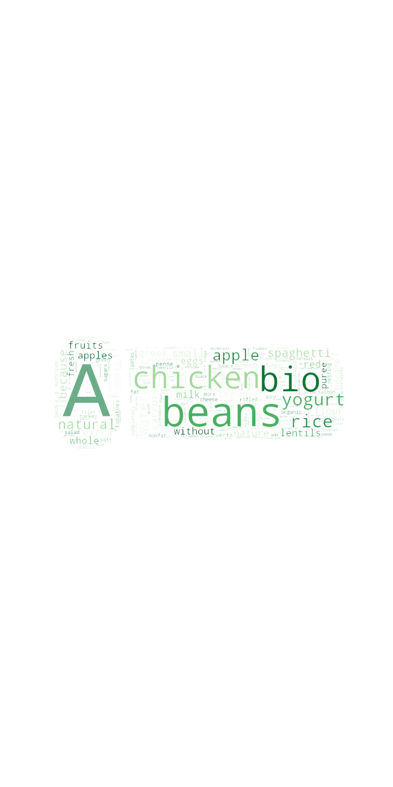
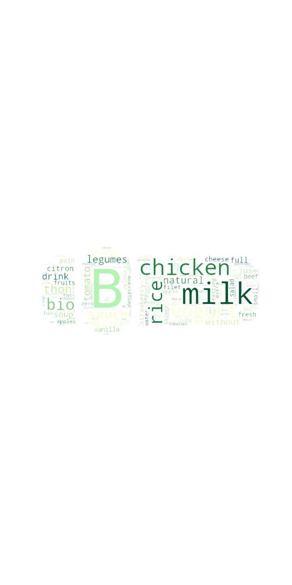
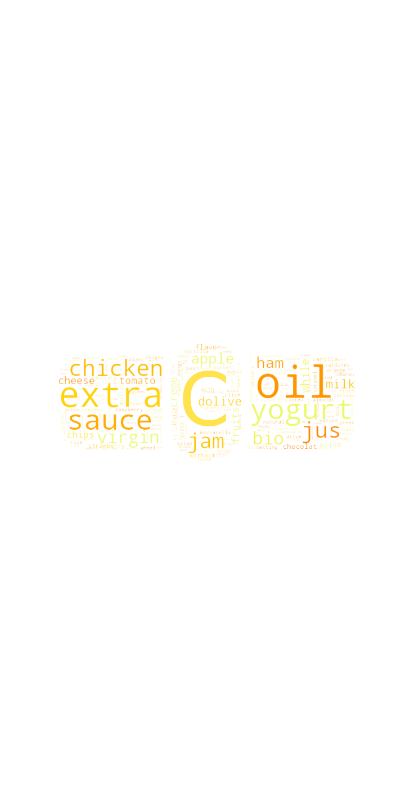
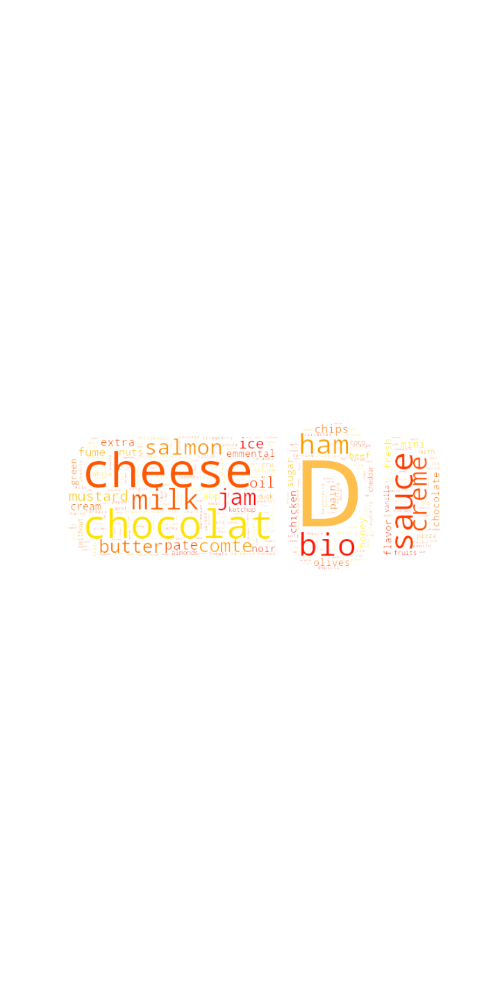

---
# Feel free to add content and custom Front Matter to this file.
# To modify the layout, see https://jekyllrb.com/docs/themes/#overriding-theme-defaults

layout: page
bigimg: /img/indexbg.jpg
---
# Where do your purchases rank in our analysis ?

## Abstract
"Nowadays, there exists a myriad of products, examples of an ever-growing consumption regime. Furthermore, the convenience of accessing such items is only a few clicks away for most of us. In this project, we will ground our reasoning on the consumer's point of view in todays world. Our starting point will be the Open food facts dataset, from which we will extract data on several different food products. Do the values that people hold dear stand up to the comparison with the food they actually buy ? Is the most sought after type of food really the one that should top such a ranking ? Are those products the ones that impact the most consumer health and are they the most environmentally-friendly ? We will try to answer these questions by coming up with a ranking containing top products regarding : consumer diet, travel from production site, carbon footprint, nutritional index, etc. These rankings will then be compared to the products bought online by consumers with the Instacart dataset, most noticeably with the popularity of particular items. We will then be able to create personalized recommendations for the consumers. They will highlight good shopping practices and the best-in-category products."

### Research questions

- What are the worst/best ranking products according to nutritional index ?
- Possible to identify specific diets ?
- How do these rankings compare to the products the users buy ?
- Can we create recommendations for users based on that data ?

> "Lorem ipsum dolor sit amet, consectetur adipiscing elit, sed do eiusmod tempor incididunt ut labore et dolore magna aliqua. Ut enim ad minim veniam, quis nostrud exercitation ullamco laboris nisi ut aliquip ex ea commodo consequat.

### Datasets
explain which datasets were used, where found, and what they gave us, plus de linking of them

## Story and answering the questions

### boxplots
<iframe id="igraph" scrolling="no" style="border:none;" seamless="seamless" src="https://marcbickel.github.io/project_gobigorgohome/boxplot_nutrition_grade.html"></iframe>

### most found words for each grade

### With footnotes too!

Back up your stuff with solid, clean citations. Footnotes can be written in markdown and appear like this.[^1] Use as many as you like.[^2]

##### Footnotes:

[^1]: This is a footnote. Click to return.

[^2]: Here is another.
