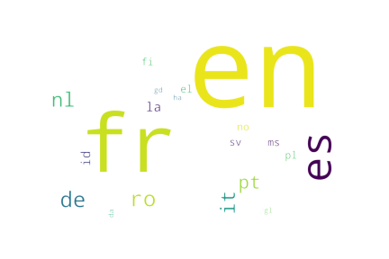

---
# Feel free to add content and custom Front Matter to this file.
# To modify the layout, see https://jekyllrb.com/docs/themes/#overriding-theme-defaults

layout: page
bigimg: /img/indexbg.jpg
---

# Do you buy healthy ?
Go big or go home narrative

# Data Story
## Introduction
Nowadays, there exists a myriad of products, examples of an ever-growing consumption regime. Furthermore, the convenience of accessing such items is only a few clicks away for most of us. In this project, we will reason on the health impact of certain foods, based on the consumer's point of view in today's world. Our starting point will be the Open food facts dataset, from which we will extract data on several different food products. Do the values that people hold dear stand up to the comparison with the food they actually buy ? Is the most sought after type of food really the one that should top such a ranking ? Are those products the ones that impact the most consumer health and are they the most environmentally-friendly ? We will try to answer these questions by coming up with a ranking containing top products regarding : consumer diet, travel from production site, carbon footprint, nutritional index, etc. These rankings will then be compared to the products bought online by consumers with the Instacart dataset, most noticeably with the popularity of particular items. We will then be able to create personalized recommendations for the consumers. They will highlight good shopping practices and the best-in-category products. 

## Presentation

Every food has intrisic nutritive and health attributes. Our body needs some nutrients and vitamins in order to functin properly, and failing to meet its demands can result in bad life hygiene or even disease. Some people pay very close attention to such properties of the products they buy, and they can enjoy their body operating at its full potential. Others however, buy ingredients thinking nutrition is not a primordial argument in the choice they make. These are the people we are going to try and help. 

First, the Open Food Facts database allows us to get data about every possible type of food, and we primarily focus on the nutrional index and nutritional score. This data represents a condensed form of the health impact that particular food has on the human body. Namely, A represents very healthy food, such as vegetables, and E is what we should avoid eating, such as chocolate. Of course, this is often the food we crave the most. The score allows for a more fine-grained aproach. 

## Datasets Presentation
description des datasets, avec quelque stats dessus

### Openfoodfacts
Open Food Facts is a database of food products with ingredients, allergens, nutrition facts and all the tidbits of information that can be found on product labels. It is open source,  maintained and turned bigger by everyday people, and that everyone can access it.  The goal is to give this information to the public, and allow it to make informed decisions about the food it consumes. 
At first, we thought of using the carbon footprint, but we realised that this particular data is available on very few of the entries of the database, rendering any kind of comparison or conclusion meaningless because of the sample size. We will then use other statistics and data on different informations given about the food products (amongst others the nutritional index).  Afterwards, we will combine different criteria in order to come up with food rankings giving for example the healthiest food for selected diets. 

### Instacart
In a second time, we will use the instacart database to find out which types of food are bought the most by the customers. We will then use this information to establish new rankings. What are the most bought products in every nutritional category ? 

#### Instacart
In a second time, we will use the instacart database to find out which types of food are bought the most by the customers. We will then use this information to find out how well the most sought after products do in the rankings we established before. Also, if we find food that is similar to the ones users bought, but higher up in our rankings, we will be recommending that new food item to new. 

We started with the Open food facts database , where we removed the rows that have more than half of the data missing. These will introduce more problems than what they can actually contribute. 
Standard outliers and NaN removal has also been applied. 
We also remove columns that are mostly empty (  >850k rows have the corresponding value missing). We now have a size-reduced dataset, but the quantity of information itself did not get reduced very much. 

<iframe align="center" id="igraph" scrolling="no" style="margin-right:auto; margin-left:auto; text-align:center;position:relative; border:none;" seamless="seamless" src="https://marcbickel.github.io/project_gobigorgohome/html/850k-filter.html" height="800px" width="150%"></iframe>

Concerning the instacart dataset, we created a product-centric dataframe, where each product is represented by a row. This view serves us much better than the previous one. We then only consider the 5% most popular products, to be able to reduce the size of the dataset. 
On se concentre sur les produits qui forment 95% des commandes, en tout environ 3000 produits. 

## Food grades

Now we have already talked quite a lot about the nutritional grades Open Food Facts, but what are they exactly ? They represent the health impact that the product has on the consumer. To be even more precise, they are defined in the Open Food Facts documentation as *nutrition score defined by the UK Food Standards Administration (FSA)*. We can see that this data is the product of serious work done by professionnals, and not only an impression written by consumers. 

A visual representation of the different grades and their most frequent words can be found below. 

## Dataset link

Now we have these two datasets that each contain interesting information about food products, and we need a way to link them. Since the only common data between the two is the naming of the products, we came up with a method that uses that particular information.  

We created a dictionnary of the most frequent words in each nutritionnal grade category.  Some results are easily predictable, like "bio" being the most used word in grade A, and "chocolate" being its counterpart in grade E. More info in the notebook. 

We then translate all these words to english, thanks to a Google Translate API. Of course some languages contained were found more frequently than others, as is illustrated below. 

<iframe id="igraph" scrolling="no" style="position:relative; border:none;" seamless="seamless" src="https://marcbickel.github.io/project_gobigorgohome/html/word-per-language-html.html" height="500px" width="150%"></iframe>

Now, we can use the formula below to cristallize the link. We compute a similiraty score for each product, based on word occurences. This allows us to assign a grade to instacart items. 

*formule mathématique pour lier les deux datasets et faire notre ranking* (redemander exactement à Lorenzo), si possible un joli truc en LaTeX

Is there a general tendency discernable amongst orders ? Below is the plot of the items per grade found in each dataset. 

*plot nombre d'items dans chaque nutri grade (plot avec des petites barres horizontales?)*
<iframe id="igraph" scrolling="no" style="position:relative; border:none;" seamless="seamless" src="https://marcbickel.github.io/project_gobigorgohome/html/items_per_grade.html" height="550px" width="100%"></iframe>

Nombre d'items uniques ou nombre total ?

## Food rankings

With that setup, we can now establish rankings. The 5 most bought products in each category can be found below. 

*5 produits les plus achetés dans A, B, C, D, E*

## Findings
Do you buy these products as well ? Are you more inclined towards the ones in the A-grade or the E-grade ? 

Here are the 5 best products people buy (justifier pourquoi best) and the 5 worst (pourquoi worst).
*les différents rankings*
<iframe id="igraph" scrolling="no" style="position:relative; border:none;" seamless="seamless" src="https://marcbickel.github.io/project_gobigorgohome/html/top5grades.html" height="600px" width="100%"></iframe>

You can find by yourself where you are situated in the complex landscape of food health. Can you regonize some of the staples of you diet ?

## Fun facts 
-big lemons ?
- Petits cornichons ?

## To go further
Instacart ça a quelle base d'utilisateurs ?
What is the user base of instacart ? It seems reasonable to think that people who buy a majority of unhealthy food don't care enough to report what they bought on a website such as Instacart. This may create a bias towards more healthy food. The fact that the ones who do buy healthy want the world to notice, and they more easily upload the data because they want the world to take notice. 
Finally, the data instacart gathers can code from sources where it is recorded automatically from online orders from people. Online ordering may indicate low-income users, who may not have enough money to be able to care about the food products health. 

### boxplots
<iframe id="igraph" scrolling="no" style="position:relative; border:none;" seamless="seamless" src="https://marcbickel.github.io/project_gobigorgohome/html/html_boxplot_carbohydrates_100g.html" height="525px" width="100%"></iframe>

